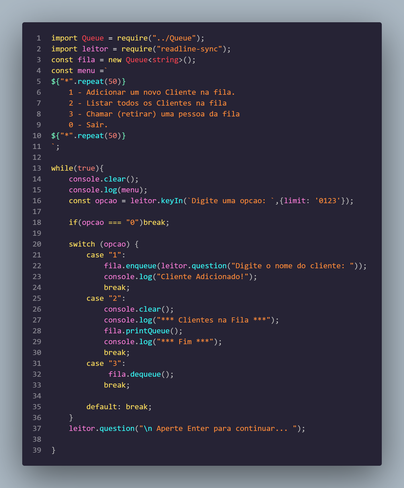
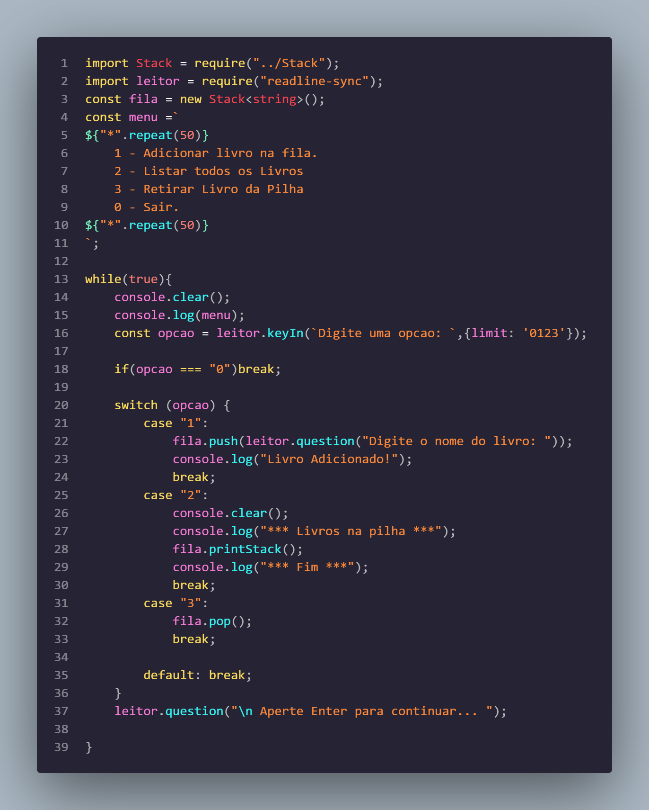
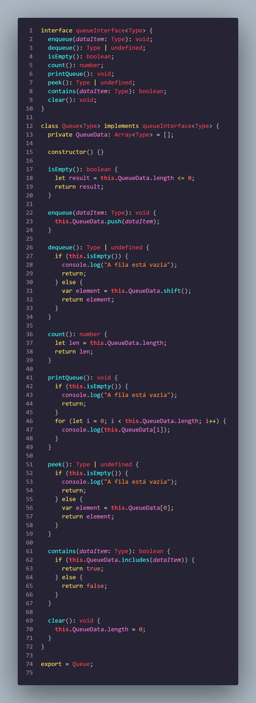
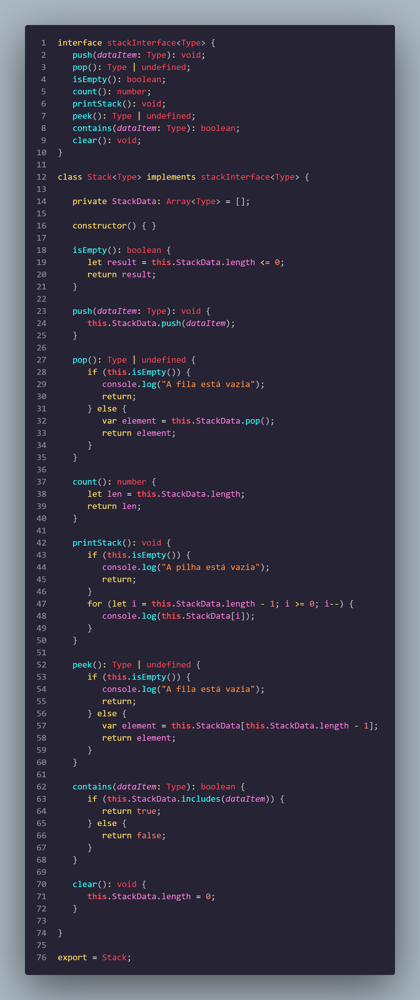

<div align="center">

# 📘 TypeScript & Estruturas de Dados — Generation Brasil (Turma JS13)

**Laboratório prático de TypeScript cobrindo Coleções (`Array`, `Set`), Estruturas de Dados Lineares Genéricas (`Queue` FIFO e `Stack` LIFO), Tipagem Estrita e Menus Interativos de Terminal via CLI**

[](https://www.typescriptlang.org/)
[](https://nodejs.org/)
[](https://brazil.generation.org/)
[]()
[]()
[](./LICENSE)

</div>

---

## 🔗 Contexto e Referências

- **Instituição:** [Generation Brasil](https://brazil.generation.org/) — Bootcamp Desenvolvedor Full-Stack JavaScript (Turma JS13)
- **Módulo:** TypeScript Core — Tipagem Estática, Collections e Estruturas de Dados Fundamentais
- **Repositórios Correlatos:** [generation_JS13_javascript](https://github.com/erickystn/generation_JS13_javascript) | [generation_JS13_Projeto_Loja_Games](https://github.com/erickystn/generation_JS13_Projeto_Loja_Games)

---

## 📖 Visão Geral

Este repositório documenta a progressão prática e os exercícios avaliativos desenvolvidos durante o módulo de **TypeScript** do bootcamp da Generation Brasil. O objetivo foi realizar a transição do JavaScript convencional para o TypeScript com tipagem estrita, compreendendo os benefícios da segurança em tempo de compilação (*static type checking*), contratos de interfaces e manipulação de memória através de estruturas de dados clássicas.

O repositório abriga implementações autorais de classes genéricas tipadas (`Queue<T>` e `Stack<T>`), além de simulações interativas no terminal (`readline-sync`) modelando filas de atendimento bancário e pilhas de livros com persistência e feedback em tempo real.

---

## ✨ Módulos e Algoritmos Mapeados

### 📂 Aula 01 — Fundamentos de TypeScript e Coleções
- **`HelloWorld.ts` & `Soma.ts`:** Introdução à sintaxe estrita do TypeScript, compilação via `tsc`, execução com `ts-node` e captura de entradas numéricas via terminal.
- **`Array.ts` & `collection_array/`:** Manipulação avançada de arrays unidimensionais tipados, algoritmos de busca de elementos por índice, identificação de posições e ordenação com comparadores numéricos.
- **`collection_set/`:** Implementação de coleções sem duplicidade utilizando a estrutura nativa `Set<number>`, explorando unicidade de dados e operações de conversão iterativa.

### 📂 Aula 02 — Estruturas de Dados Lineares e Genéricas
- **Classe `Queue<T>` (Fila FIFO — First-In, First-Out):**
  - Implementação genérica com encapsulamento de array interno privado.
  - Métodos implementados: `enqueue(data)` (enfileirar), `dequeue()` (desenfileirar), `peek()` (inspecionar topo), `isEmpty()`, `count()` e `printQueue()`.
- **Classe `Stack<T>` (Pilha LIFO — Last-In, First-Out):**
  - Implementação genérica com encapsulamento de array interno privado.
  - Métodos implementados: `push(data)` (empilhar), `pop()` (desempilhar), `peek()` (inspecionar topo), `isEmpty()`, `count()` e `printStack()`.
- **Exercício Prático 01 (`aula_02/exercicios/exercicio_1.ts`) — Simulador de Fila de Banco:**
  - Menu interativo via terminal para entrada de clientes na fila de atendimento.
  - Comandos: `1` (Adicionar cliente), `2` (Listar clientes na fila), `3` (Chamar próximo cliente para atendimento) e `0` (Sair).
- **Exercício Prático 02 (`aula_02/exercicios/exercicio_2.ts`) — Simulador de Pilha de Livros:**
  - Menu interativo via terminal gerenciando uma pilha de títulos literários.
  - Comandos: `1` (Adicionar livro), `2` (Listar livros na pilha), `3` (Retirar livro do topo) e `0` (Sair).

---

## 🎯 Diferenciais e Destaques Técnicos

1. **Implementação de Generics (`<T>`):**
   Tanto a classe `Queue<T>` quanto a `Stack<T>` foram concebidas utilizando tipos genéricos, permitindo que a mesma estrutura seja reaproveitada para cadeias de texto (`Queue<string>`), números (`Stack<number>`) ou objetos complexos de domínio com segurança estrita em tempo de compilação.
2. **Encapsulamento Rígido:**
   Os dados internos das coleções são mantidos estritamente privados (`private ArrayQueue: T[] = []` e `private ArrayStack: T[] = []`), garantindo que a integridade dos princípios FIFO e LIFO não seja violada por acessos externos diretos.
3. **Menus Interativos com Tratamento Defensivo:**
   Os loops de execução em `while (true)` utilizam a biblioteca `readline-sync` com validação de opções inválidas e verificação de estruturas vazias (`isEmpty()`) antes da execução de operações de desempilhar ou desenfileirar, evitando exceções em tempo de execução.
4. **Configuração Customizada de Compilador (`tsconfig.json`):**
   Ambiente configurado com `strict: true`, `target: "ES2022"`, `moduleResolution: "node"` e `noImplicitAny: true`.

---

## 🏗️ Estrutura de Pastas do Repositório

```text
generation_JS13_typescript/
├── aula_01/                                # Fundamentos e coleções básicas
│   ├── exercicios/
│   │   ├── collection_array/               # Exercícios práticos com Arrays
│   │   └── collection_set/                 # Exercícios práticos com Sets
│   ├── Array.ts                            # Testes de métodos de Array
│   ├── HelloWorld.ts                       # Script introdutório
│   └── Soma.ts                             # Entrada e cálculo com readline-sync
├── aula_02/                                # Estruturas de dados genéricas
│   ├── exercicios/
│   │   ├── exercicio_1.ts                  # CLI: Simulação de Fila de Banco (Queue FIFO)
│   │   ├── exercicio_2.ts                  # CLI: Simulação de Pilha de Livros (Stack LIFO)
│   │   ├── exercicio_1.png                 # Evidência de execução da Fila
│   │   ├── exercicio_2.png                 # Evidência de execução da Pilha
│   │   ├── Queue.png                       # Diagrama conceitual da Fila
│   │   └── Stack.png                       # Diagrama conceitual da Pilha
│   ├── CollecaoMap.ts                      # Estrutura Map chave-valor
│   ├── Queue.ts                            # Implementação da classe genérica Queue<T>
│   └── Stack.ts                            # Implementação da classe genérica Stack<T>
├── package.json                            # Dependências e metadados (readline-sync, typescript)
├── tsconfig.json                           # Configurações do compilador TypeScript
└── readme.md                               # Documentação técnica consolidada do repositório
```

---

## 🎨 Diagrama das Estruturas de Dados Lineares

### Fila (Queue) — Comportamento FIFO:
```text
Entrada (enqueue) ────────► [ Cliente C ] ─► [ Cliente B ] ─► [ Cliente A ] ────────► Saída (dequeue)
(Fim da Fila)                                                                     (Início da Fila)
```

### Pilha (Stack) — Comportamento LIFO:
```text
                            Entrada (push) / Saída (pop)
                                        │   ▲
                                        ▼   │
                                  ┌──────────────┐
                                  │  Livro C     │  ◄── Topo da Pilha
                                  ├──────────────┤
                                  │  Livro B     │
                                  ├──────────────┤
                                  │  Livro A     │  ◄── Base da Pilha
                                  └──────────────┘
```

---

## 📸 Evidências de Execução e Testes

<details>
<summary><b>Clique para visualizar as capturas dos testes no terminal</b></summary>

<br />

#### Execução da Fila de Banco (`exercicio_1.ts`):


#### Execução da Pilha de Livros (`exercicio_2.ts`):


#### Conceito Estrutural da Fila:


#### Conceito Estrutural da Pilha:


</details>

---

## 🧭 Passo a Passo de Uso dos Menus Interativos (CLI)

### Simulador de Fila de Banco (`exercicio_1.ts`)
1. Inicie o script no terminal.
2. O sistema exibirá o menu com as opções: `1 - Adicionar Cliente na Fila`, `2 - Listar todos os Clientes`, `3 - Retirar Cliente da Fila` e `0 - Sair`.
3. Digite `1` e informe o nome do cliente para adicioná-lo ao final da fila.
4. Digite `2` para inspecionar visualmente a ordem de atendimento atual.
5. Digite `3` para atender e remover o cliente que está na primeira posição.
6. Digite `0` para encerrar a aplicação com mensagem de finalização.

### Simulador de Pilha de Livros (`exercicio_2.ts`)
1. Inicie o script no terminal.
2. O menu apresentará as opções de gerenciamento: `1 - Adicionar Livro na Pilha`, `2 - Listar todos os Livros`, `3 - Retirar Livro da Pilha` e `0 - Sair`.
3. Escolha `1` e digite o título do livro para inseri-lo no topo da pilha.
4. Escolha `2` para listar todos os livros atualmente empilhados.
5. Escolha `3` para remover o livro que está no topo.
6. Escolha `0` para fechar o programa.

---

## ⚙️ Requisitos e Configuração do Ambiente

- **Node.js:** Versão 18.x ou superior (LTS)
- **NPM:** Gerenciador de pacotes integrado
- **TypeScript:** Instalado como dependência de desenvolvimento ou globalmente (`npm install -g typescript ts-node`)

---

## 🚀 Como Executar o Projeto

### 1. Clonagem e Instalação
```bash
# Clone o repositório
git clone https://github.com/erickystn/generation_JS13_typescript.git

# Acesse o diretório
cd generation_JS13_typescript

# Instale as dependências (readline-sync, ts-node, etc.)
npm install
```

### 2. Execução dos Menus Interativos via `ts-node`

#### Executar a Fila de Banco:
```bash
npx ts-node aula_02/exercicios/exercicio_1.ts
```

#### Executar a Pilha de Livros:
```bash
npx ts-node aula_02/exercicios/exercicio_2.ts
```

#### Executar Exercícios da Aula 01:
```bash
npx ts-node aula_01/Soma.ts
```

---

## 💻 Exemplos Reais de Código

### 1. Implementação da Classe Genérica `Queue<T>` (`aula_02/Queue.ts`)
```typescript
export class Queue<T> {
  private ArrayQueue: T[] = [];

  constructor() {}

  enqueue(data: T): void {
    this.ArrayQueue.push(data);
  }

  dequeue(): T | undefined {
    if (this.isEmpty()) {
      console.log("A Fila está vazia!");
      return undefined;
    }
    return this.ArrayQueue.shift();
  }

  isEmpty(): boolean {
    return this.ArrayQueue.length === 0;
  }

  count(): number {
    return this.ArrayQueue.length;
  }

  printQueue(): void {
    for (let i = 0; i < this.ArrayQueue.length; i++) {
      console.log(this.ArrayQueue[i]);
    }
  }
}
```

### 2. Loop Interativo da Fila de Banco (`aula_02/exercicios/exercicio_1.ts`)
```typescript
import read = require("readline-sync");
import { Queue } from "../Queue";

const fila = new Queue<string>();
let opcao: number;

while (true) {
  console.log("\n*****************************************************");
  console.log("1 - Adicionar Cliente na Fila");
  console.log("2 - Listar todos os Clientes");
  console.log("3 - Retirar Cliente da Fila");
  console.log("0 - Sair");
  console.log("*****************************************************");

  opcao = read.questionInt("Entre com a opcao desejada: ");

  if (opcao === 0) {
    console.log("\nPrograma Finalizado!");
    process.exit(0);
  }

  switch (opcao) {
    case 1:
      const nome = read.question("Digite o nome: ");
      fila.enqueue(nome);
      console.log("\nFila:");
      fila.printQueue();
      console.log("\nCliente Adicionado!");
      break;
    case 2:
      console.log("\nLista de Clientes na Fila:");
      fila.printQueue();
      break;
    case 3:
      fila.dequeue();
      console.log("\nFila:");
      fila.printQueue();
      console.log("\nO Cliente foi Chamado!");
      break;
  }
}
```

---

## 🛠️ Tecnologias Utilizadas

| Tecnologia | Finalidade Técnica |
| :--- | :--- |
| **TypeScript 5.x** | Linguagem tipada estaticamente para segurança de tipos e contratos de generics. |
| **Node.js** | Ambiente de execução JavaScript/TypeScript no servidor e terminal. |
| **ts-node** | Executor direto de scripts TypeScript em runtime sem etapa manual de build. |
| **readline-sync** | Captura síncrona de entradas do usuário para construção de interfaces CLI. |

---

## 📈 Trilha de Aprendizado da Formação

```text
[Lógica em Portugol] ──► [JavaScript Core] ──► [TypeScript & Estruturas de Dados] ──► [POO & Backend NestJS]
                                                       ▲
                                               (Este Repositório)
```

---

## 🤝 Como Contribuir

1. Realize um **Fork** do repositório.
2. Crie uma branch para seu exercício: `git checkout -b feature/minha-estrutura`.
3. Faça o commit de suas alterações: `git commit -m "feat: implementa Arvore Binaria em TypeScript"`.
4. Envie a branch para o seu repositório remoto: `git push origin feature/minha-estrutura`.
5. Abra um **Pull Request**.

---

## 👤 Autor & 📄 Licença

Desenvolvido por **[Ericky Santana](https://github.com/erickystn)** durante o bootcamp da **Generation Brasil**.

Este projeto é de código aberto e está licenciado sob os termos da licença **MIT** — consulte o arquivo [LICENSE](./LICENSE) para mais detalhes.